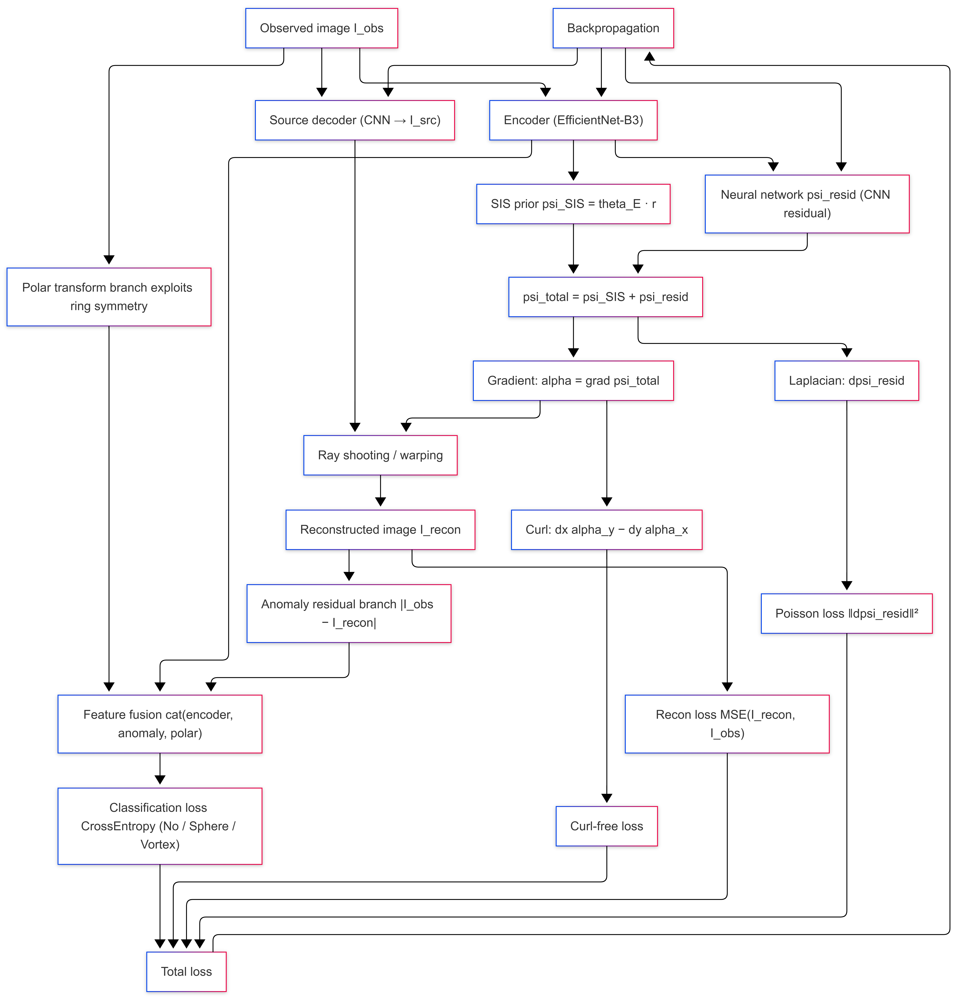

# GSoC 2026 | ML4SCI DeepLense Evaluation Tasks

**Applicant:** Anukul Kumar  
**Organization:** Machine Learning for Science (ML4SCI)  
**Project:** DeepLense: Deep Learning for Strong Gravitational Lensing Analysis  
**Framework:** PyTorch | **Hardware:** NVIDIA H100 (Kaggle)

---

## Overview

This repository contains solutions to the DeepLense evaluation tasks for GSoC 2026. 
Strong gravitational lensing is a powerful observational probe of dark matter substructure. The core 
challenge across all tasks is distinguishing lensing images with no substructure from those containing 
cold dark matter subhalo substructure or axion-like particle (vortex) substructure.

---

## Repository Structure

```
GSoC2026_Deeplense_Task/
├── Deeplense_CommonTask_Comparison.ipynb    # Task I:   Multi-class classification (3 models compared)
├── PINN_Classification50Epoch_TaskVII.ipynb # Task VII: Physics-informed neural network
├── TaskIX_FoundationModel.ipynb             # Task IX.A & IX.B: MAE pre-training, classification, super-resolution
└── README.md
```

---

## Task I: Multi-Class Classification (Common Test)

**Objective:** Classify strong lensing images into three categories: no substructure, spherical substructure, and vortex substructure. Evaluate multiple architectures and select the best.

**Dataset:** Three classes: `no_sub`, `sphere`, `vort`. Images are 150x150 (resized from raw), min-max normalized, single-channel `.npy` files. Split: 27,000 train / 3,000 val / 7,500 test (provided val dataset).

### Approach

Three pretrained ImageNet models were compared under identical training conditions (30 epochs, CrossEntropyLoss, best-val-accuracy checkpoint). Single-channel images were replicated to three channels to match 
pretrained input expectations. Augmentation included random 10-degree rotations and horizontal flips. All models were evaluated on the held-out test set using macro ROC-AUC.

### Model Pipeline

<!-- Add architecture comparison diagram here -->
<!-- Example:  -->

### Results

| Model | Accuracy | No Sub AUC | Sphere AUC | Vortex AUC | Macro AUC |
|---|---|---|---|---|---|
| ResNet-18 | 0.9443 | 0.9924 | 0.9858 | 0.9950 | 0.9911 |
| ResNet-34 | 0.9479 | 0.9924 | 0.9852 | 0.9946 | 0.9908 |
| **EfficientNet-B3** | **0.9605** | **0.9946** | **0.9907** | **0.9971** | **0.9941** |

**EfficientNet-B3 was selected as the best model**, achieving 96.05% accuracy and a macro AUC of 0.9941 on the test set.

---

## Task VII: Physics-Guided ML (Specific Test)

**Objective:** Build a Physics-Informed Neural Network (PINN) whose architecture embeds the gravitational lensing equation as a structural forward pass, improving upon the Common Test baseline.

**Dataset:** Same three-class lensing dataset. Images are 150x150 single-channel `.npy` files. Split: 27,000 train / 3,000 internal test (10% holdout) / 7,500 provided val folder.

### Architecture: PINNLensNet

The PINN does not merely add a physics penalty to a standard classifier. The lensing equation is embedded as a differentiable computational graph within the forward pass. The full pipeline proceeds as follows:

**1. Backbone encoder:** EfficientNet-B3 (pretrained, adapted for single-channel input by averaging the first convolution weights across the channel dimension). Outputs a 1536-dim feature vector.

**2. Gravitational potential head (PotentialHead):** Predicts the total lensing potential `psi_total = psi_SIS + psi_resid`.
- `psi_SIS = theta_E * r` is a Singular Isothermal Sphere prior with a learnable Einstein radius `theta_E` predicted from the feature vector.
- `psi_resid` is a CNN-decoded residual potential map capturing deviations from the SIS baseline (subhalo and vortex signals).

**3. Deflection field (curl-free by construction):** `alpha = grad(psi_total)`, computed via Sobel-kernel finite differences. Because `alpha` is derived from a scalar potential, it is structurally curl-free, satisfying a necessary condition for a physical deflection field.

**4. Lensing warp (LensWarp):** Implements the lens equation `beta = theta - alpha(theta)` as a differentiable grid sampling operation. A source image is decoded from features, then warped through the predicted deflection field to reconstruct the observed image.

**5. Anomaly residual branch:** `residual = |I_obs - I_recon|`. This difference map isolates substructure signal not explained by the smooth SIS potential. A compact CNN encoder converts it to a 128-dim feature vector.

**6. Polar coordinate branch:** A differentiable polar transform maps the input to polar coordinates, exploiting the approximate circular symmetry of gravitational lensing. A separate CNN encoder produces a 128-dim polar feature vector.

**7. Classifier:** The backbone feature (1536-dim), residual feature (128-dim), and polar feature (128-dim) are concatenated (1792-dim total) and passed through a two-layer MLP head with dropout.

**Total parameters:** 22.7M (encoder: 10.7M, potential head: 7.4M, source decoder: 3.6M, residual branch: 32K, polar branch: 110K, classifier: 920K).

### Model Pipeline



### Physics Losses

The training objective combines classification loss with three physics-regularization terms, curriculum-ramped over 5 warmup epochs (physics weight scales from 0.1 to 1.0):

| Loss Term | Mathematical Form | Physical Meaning |
|---|---|---|
| Poisson constraint | $\|\Delta \psi_{\text{resid}}\|^2$ | Subhalo convergence $\kappa_{\text{sub}}$ should be compact |
| Curl-free constraint | $\| \partial_x \alpha_y - \partial_y \alpha_x \|^2$ | Deflection field must be irrotational |
| Reconstruction | $\text{MSE}(I_{\text{recon}}, I_{\text{obs}})$ | Warped source must match observed image |

### Training Configuration

| Hyperparameter | Value |
|---|---|
| Optimizer | Adam (encoder lr=5e-5, physics heads lr=1e-4, weight decay=1e-4) |
| Scheduler | CosineAnnealingLR (T_max=50, eta_min=1e-6) |
| Gradient clipping | max_norm=1.0 |
| Epochs | 50 |
| Batch size | 32 |
| Input size | 150x150 |
| Physics warmup | 5 epochs |

### Results

| Split | Macro AUC |
|---|---|
| Internal test (10% holdout) | **0.9897** |
| Provided val folder | **0.9893** |

Best checkpoint: epoch 46, val AUC 0.9893.

### Comparison with Common Test Baseline

| Model | Macro AUC | No | Sphere | Vortex|
|---|---|---|---|---|
| Resnet-18(Pre-trained) | 0.9911 | 0.9858 | 0.9950 | 0.9924 |
| EfficientNet-B3(No-Physics) | 0.9963 | 0.9960 | 0.9941 | 0.9988 |
| EfficientNet-B3 + Recon Loss | 0.9959 | 0.9956 | 0.9931 | 0.9989 |
| EfficientNet-B3 + SIS Prior | 0.9958 | 09962 | 0.9926 | 0.9987 |
| **PINNLensNet ** | **0.9897** | 0.9913 | 0.9826 | 0.9941 |

---

## Task IX.A: Foundation Model - MAE Pre-training and Fine-tuning

**Objective:** Train a Masked Autoencoder (MAE) on `no_sub` samples to learn general lensing image representations, then fine-tune for three-class classification (no_sub, cdm, axion).

**Dataset:** Three classes: `no_sub`, `cdm` (cold dark matter substructure), `axion` (axion-like particle substructure). Images are 64x64 single-channel `.npy` files. Split: 90% train / 10% test (seed 42).

### Architecture

A lightweight Vision Transformer (ViT) was designed from scratch and optimized for 64x64 single-channel astrophysical images. The same encoder backbone is shared across pre-training, classification fine-tuning, and super-resolution (Task IX.B).

| Component | Specification |
|---|---|
| Patch size | 4x4 (256 patches per image) |
| Embedding dimension | 192 |
| Encoder depth | 6 transformer blocks |
| Attention heads | 3 |
| MLP expansion | 4x with GELU activation |
| Normalization | Pre-norm LayerNorm per block |
| Decoder depth | 4 transformer blocks |
| Decoder prediction head | Linear: 192 -> 16 (one 4x4 patch of pixels) |
| Mask ratio (pre-training) | 90% random patch masking |

**Classifier head:** A learnable CLS token is prepended to the patch sequence. The CLS token output after the final encoder block feeds a linear classification head.

### MAE Pipeline

<!-- Add MAE pipeline diagram here: image -> patchify -> random mask (90%) -> ViT encoder (visible patches) -> mask tokens -> transformer decoder -> reconstruct masked patches -->
<!-- Example:  -->

### Pre-training

The MAE was trained exclusively on `no_sub` samples without labels. The reconstruction target is per-patch pixel-normalized values; loss is computed only on the 90% masked patches, following He et al. (2022).

| Hyperparameter | Value |
|---|---|
| Pre-training data | `no_sub` class only (self-supervised) |
| Optimizer | AdamW (weight decay=0.05) |
| Learning rate | 1.5e-4 with linear warmup + cosine decay |
| Warmup / total epochs | 3 / 15 |
| Batch size | 64 |

MAE reconstruction loss converged from 0.2636 (epoch 1) to 0.0023 (epoch 15).

### MAE Reconstruction Examples

<!-- Add side-by-side reconstruction comparisons: original | masked input (90%) | reconstruction -->
<!-- Example:  -->

### Fine-tuning Protocol

A two-stage fine-tuning strategy was applied to preserve pre-trained representations:

**Stage 1 - Head warm-up (5 epochs):** Encoder frozen. Only the CLS token and linear head trained at lr=1e-3. Prevents random-head gradients from corrupting the encoder on the first pass.

**Stage 2 - Full fine-tuning (up to 15 epochs):** Encoder unfrozen. AdamW at lr=5e-5 with cosine annealing and early stopping on validation AUC (patience=5). Best checkpoint restored at end.

| Hyperparameter | Value |
|---|---|
| Batch size | 32 |
| Loss | CrossEntropyLoss |
| Augmentation | Horizontal/vertical flips, 90-degree rotations |
| Stage 2 optimizer | AdamW (lr=5e-5, weight decay=1e-4) |
| Stage 2 scheduler | CosineAnnealingLR |

### Classification Results

| Class | AUC Score |
|---|---|
| no_sub | **0.9998** |
| cdm | **0.9940** |
| axion | **0.9952** |
| **Macro Average** | **0.9963** |

Final validation accuracy: 96.1% at epoch 15 of Stage 2.

<!-- Add ROC curves here (one curve per class) -->
<!-- Example:  -->

---

## Task IX.B: Foundation Model - Super-Resolution Fine-tuning

**Objective:** Fine-tune the MAE pre-trained encoder from Task IX.A for super-resolution: upscaling low-resolution (LR) strong lensing images to high-resolution (HR, 150x150) outputs.

**Dataset:** Simulated no-substructure lensing images at paired LR and HR (150x150) resolutions.

### Architecture: ViTSuperRes

The MAE ViT encoder is reused as the feature extractor. A convolutional SR decoder (`SRDecoder`) upsamples the 16x16 spatial patch grid through three transposed convolution stages, with a final bilinear interpolation to the 150x150 HR target:

```
LR input -> ViT encoder (16x16 patch grid) -> SRDecoder:
  ConvTranspose2d: 16x16 -> 32x32  (192 -> 128 ch, BN + GELU)
  ConvTranspose2d: 32x32 -> 64x64  (128 ->  64 ch, BN + GELU)
  ConvTranspose2d: 64x64 -> 128x128 ( 64 ->  32 ch, BN + GELU)
  Conv2d head:    128x128 -> 128x128 (32 -> 16 -> 1 ch, GELU)
  Bilinear resize: 128x128 -> 150x150
```

Total model: 3.28M parameters (562K decoder-only for Phase 1 training).

### SR Pipeline

<!-- Add SR pipeline diagram here: LR input -> ViT encoder -> SRDecoder -> HR output | ground truth comparison -->
<!-- Example:  -->

### Training Configuration

| Phase | Epochs | Trainable Params | Optimizer | LR |
|---|---|---|---|---|
| Phase 1: Decoder warm-up (encoder frozen) | 10 | 562K | AdamW | 1e-3 |
| Phase 2: Full fine-tuning | 10 | 3.28M | AdamW | 1e-4 |

Phase 1 val MSE: 1.94e-4 (epoch 1) -> 1.00e-4 (epoch 10). Phase 2 val MSE: further reduced to 8.9e-5 (epoch 10).

### Qualitative Comparison

<!-- Add 4-column comparison panels: LR (bicubic upscaled) | ViT-SR output | HR ground truth | |SR - HR| residual map -->
<!-- Example:  -->

### Quantitative Results

| Model | MSE | SSIM | PSNR (dB) |
|---|---|---|---|
| Bicubic Baseline | 0.000100 | 0.9689 | 40.01 |
| **ViT-SR (Ours)** | **0.000089** | **0.9758** | **40.49** |
| Improvement | -11% | +0.0069 | +0.48 dB |

The ViT-SR model consistently outperforms bicubic interpolation across all three metrics. The MAE pre-training provides patch-level spatial priors that transfer directly to the reconstruction objective, yielding sharper high-frequency detail in reconstructed lensing images.

---

## Environment

```
Python        3.12
PyTorch       2.x
torchvision   0.x
timm
scikit-learn
numpy
matplotlib
tqdm
```

```bash
pip install torch torchvision timm scikit-learn numpy matplotlib tqdm
```

All experiments were run on Kaggle with an NVIDIA H100 GPU.

---

## Results Summary

| Task | Model | Macro AUC / Metric |
|---|---|---|
| I: Classification | EfficientNet-B3 (best of 3) | AUC 0.9941 |
| VII: PINN | PINNLensNet (EfficientNet-B3 + physics) | AUC 0.9893 |
| IX.A: MAE + Finetune | Custom ViT-MAE | AUC 0.9963 |
| IX.B: Super-Resolution | ViT-SR (MAE encoder + SRDecoder) | PSNR 40.49 dB, SSIM 0.9758 |

---

## Acknowledgements

This work is submitted as part of the GSoC 2026 application to the ML4SCI organization under the DeepLense project. Datasets are provided by the DeepLense team. The MAE architecture follows the self-supervised pre-training formalism of He et al. (2022), adapted and implemented from scratch for single-channel astrophysical imaging on 64x64 resolution inputs.
