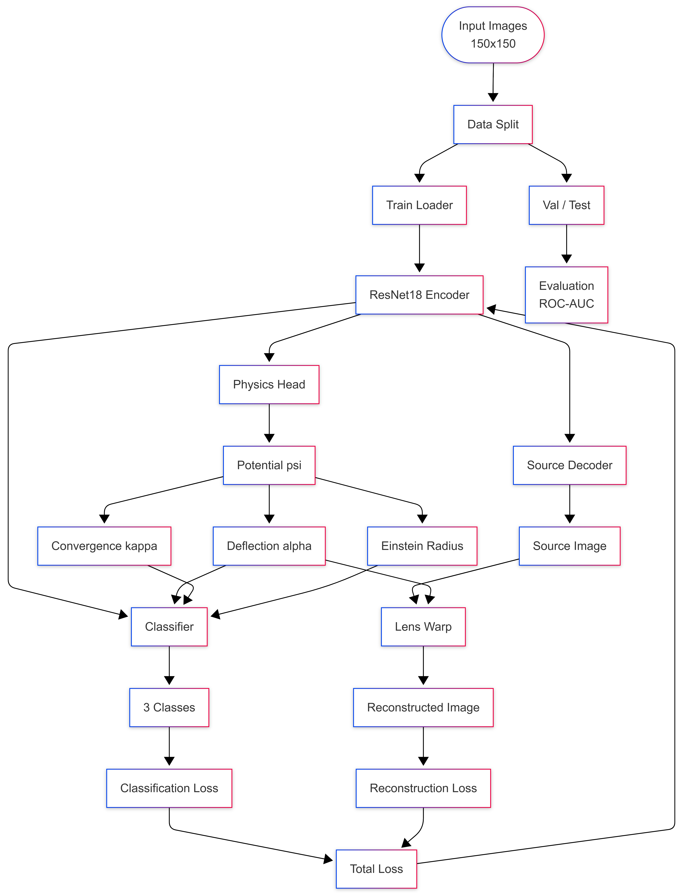
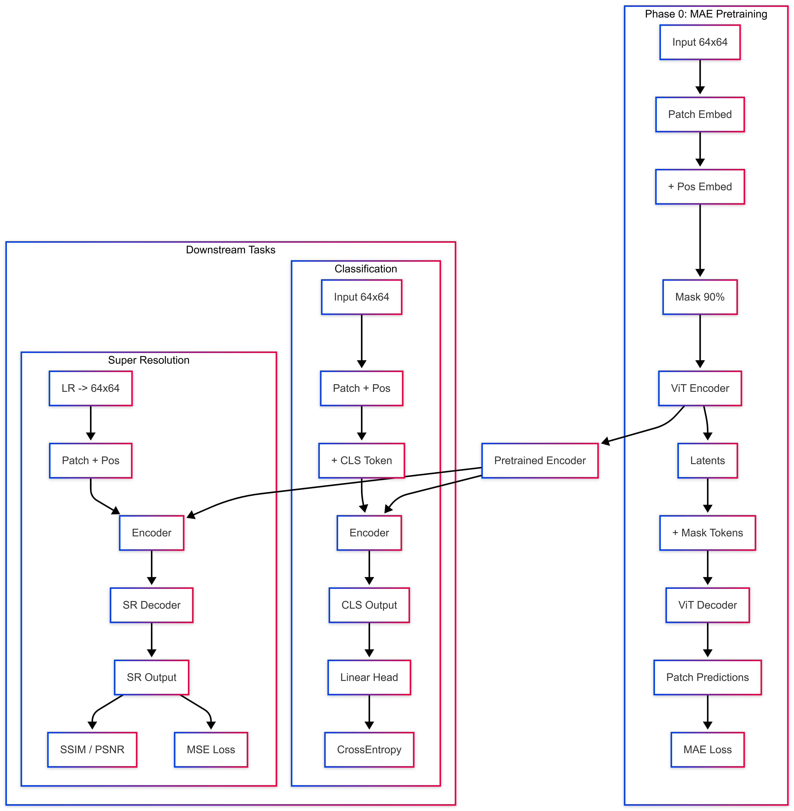
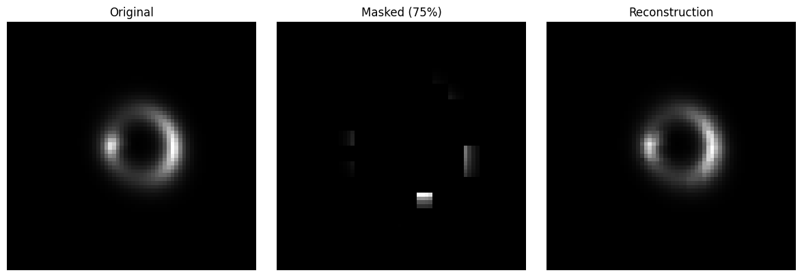
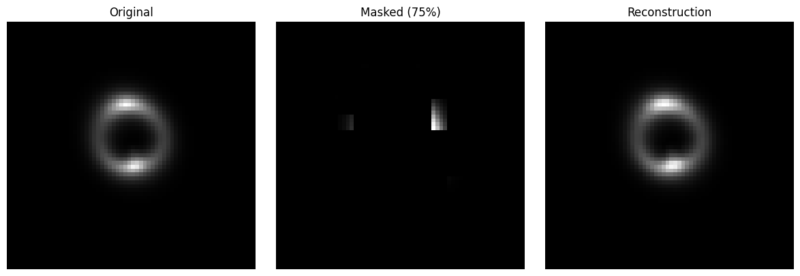
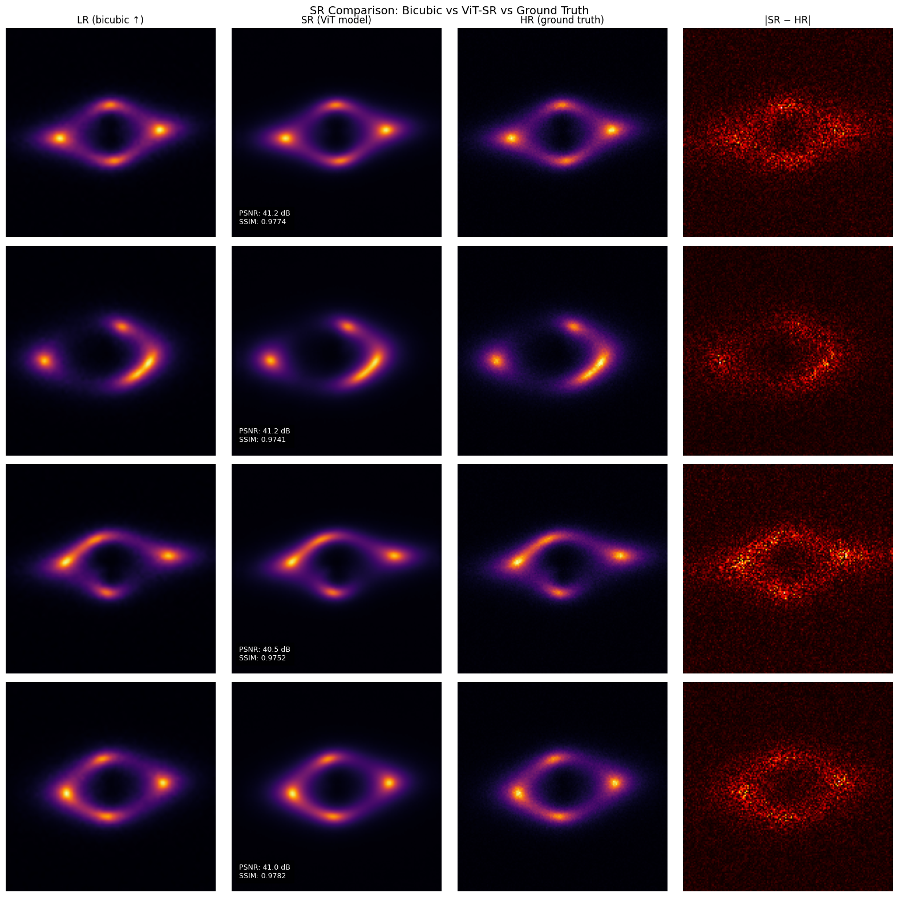

# GSoC 2026 | ML4SCI DeepLense Evaluation Tasks

**Applicant:** Anukul Tiwari  
**Organization:** Machine Learning for Science (ML4SCI)  
**Project:** Deeplense - Foundation Model for Gravitational Lensing  
**Framework:** PyTorch | **Hardware:** NVIDIA H100 (Kaggle)

---

## Overview

This repository contains solutions to the DeepLense evaluation tasks for the Foundation Model Project in GSoC 2026. 

---

## Repository Structure

```
GSoC2026_Deeplense_Task/
├── Results_and_Images                       # Contains Results and Images regarding every Task
    ├── CommonTask_Results
    ├── TaskIX_results
    ├── TaskVII_Results
    └── Other Images...
├── Deeplense_CommonTask_Comparison.ipynb    # Task I:   Multi-class classification (3 models compared)
├── PINN_Classification50Epoch_TaskVII.ipynb # Task VII: Physics-informed neural network
├── TaskIX_FoundationModel.ipynb             # Task IX.A & IX.B: MAE pre-training, classification, super-resolution
└── README.md
```

---

## Task I: Multi-Class Classification (Common Test)

**Objective:** Classify strong lensing images into three categories: no substructure, spherical substructure, and vortex substructure. Evaluate multiple architectures and select the best.

**Dataset:** Three classes: `no_sub`, `sphere`, `vort`. Images are 150x150 (resized from raw), min-max normalized, single-channel `.npy` files. Split: 27,000 train / 3,000 val / 7,500 test (provided val dataset).

### Approach

Three pretrained ImageNet models were compared under identical training conditions (30 epochs, CrossEntropyLoss, best-val-accuracy checkpoint). Single-channel images were replicated to three channels to match 
pretrained input expectations. Augmentation included random 10-degree rotations and horizontal flips. All models were evaluated on the held-out test set using macro ROC-AUC.

### Results

| Model | Accuracy | No Sub AUC | Sphere AUC | Vortex AUC | Macro AUC |
|---|---|---|---|---|---|
| ResNet-18 | 0.9443 | 0.9924 | 0.9858 | 0.9950 | 0.9911 |
| ResNet-34 | 0.9479 | 0.9924 | 0.9852 | 0.9946 | 0.9908 |
| **EfficientNet-B3** | **0.9605** | **0.9946** | **0.9907** | **0.9971** | **0.9941** |

**EfficientNet-B3 was selected as the best model**, achieving 96.05% accuracy and a macro AUC of 0.9941 on the test set.
And was later used as the backbone for Task VII.

---

## Task VII: Physics-Guided ML (Specific Test)

**Objective:** Build a Physics-Informed Neural Network (PINN) whose architecture embeds the gravitational lensing equation into the forward pass, improving upon the Common Test baseline.

**Dataset:** Same three-class lensing dataset. Images are 150x150 single-channel `.npy` files. Split: 27,000 train / 3,000 internal test (10% holdout) / 7,500 provided val folder.

### Approaches Explored

Three distinct PINN architectures were developed to explore the trade-offs between physical constraints and deep learning flexibility.

#### Approach 1: Baseline PINN (ResNet-18)
*File: `PINN_TaskVII_Approach1.ipynb`*

This model establishes the fundamental "Structural PINN" architecture. Instead of treating the deflection field $\alpha$ as a free regression target, it is mathematically defined as the gradient of a learned potential field $\psi$ ($\alpha = \nabla \psi$).
- **Physics-by-Construction:** By driving $\alpha$ from a scalar potential, the deflection field is strictly curl-free by design, satisfying the necessary physical condition for gravitational lensing.
- **Pipeline:** A ResNet-18 encoder predicts the potentials. A `LensWarp` layer uses the lensing equation $\beta = \theta - \alpha(\theta)$ to reconstruct the image. The classifier uses the encoder features augmented with scalar physics metrics (Stein radius $\theta_E$, mean deflection $|\alpha|$).



#### Approach 2: Advanced Adaptive PINN (ResNet-18)
*File: `PINN_TaskVII_Approach2.ipynb`*

This approach introduces advanced inductive biases and optimization techniques to address the difficulty of training PINNs with conflicting loss terms.
- **Adaptive Uncertainty Loss:** Instead of manually tuning hyperparameters for the 7 different loss terms (Poisson, Curl, Reconstruction, etc.), a Kendall-style learned loss weighting is used. The model learns to "trust" different physics constraints at different stages of training.
- **Polar Symmetry:** Recognizing that gravitational lenses are approximately circularly symmetric, a parallel **Polar Branch** transforms images into polar coordinates. This makes radial features (like Einstein rings) appear as linear features, which are easier for CNNs to process.
- **Cycle Consistency:** Enforces a stricter physical constraint: `Delens(Lens(Source)) ≈ Source`.


#### Approach 3: Hybrid Fusion PINN (EfficientNet-B3)
*File: `PINN_TaskVII_Approach3.ipynb`*

Formerly `PINNLensNet`, this approach hypothesizes that while physical constraints are crucial, the raw feature extraction power of modern architectures should not be discarded.
- **Backbone Upgrade:** Utilizes the more powerful **EfficientNet-B3** (pretrained on ImageNet) compared to the ResNet-18 used in Approaches 1 and 2.
- **Hybrid Feature Fusion:** Instead of relying solely on physical fields ($\alpha, \kappa$) for classification, this model concatenates **Three Feature Sets**:
  1.  **Backbone Features (1536-dim):** Deep textural and semantic features.
  2.  **Physics Features (256-dim):** Anomaly residuals and potential maps processed by a small CNN.
  3.  **Polar Features (128-dim):** Symmetry-aware representations.
- **Goal:** To combine the robustness of standard CNNs with the interpretability and constraints of PINNs.


### Results & Comparison

| Model | Mean Val-AUC | No Substructure | Sphere | Vortex |
|---|---|---|---|---|
| **Approach 1 (Baseline)** | **0.9933** | **0.9948** | **0.9884** | **0.9969** |
| Approach 2 (Adaptive) | 0.9902 | 0.9936 | 0.9831 | 0.9937 |
| Approach 3 (Hybrid) | 0.9893 | 0.9913 | 0.9826 | 0.9941 |

### Comparison with Common Test Baseline

| Model | Macro AUC | No | Sphere | Vortex|
|---|---|---|---|---|
| Resnet-18(Pre-trained) | 0.9911 | 0.9858 | 0.9950 | 0.9924 |
| EfficientNet-B3(No-Physics) | 0.9963 | 0.9960 | 0.9941 | 0.9988 |
| EfficientNet-B3 + Recon Loss | 0.9959 | 0.9956 | 0.9931 | 0.9989 |
| EfficientNet-B3 + SIS Prior | 0.9958 | 09962 | 0.9926 | 0.9987 |

### Inference & Conclusion for Task VII

All three PINN approaches achieved high performance (>0.989 AUC), validating the effectiveness of embedding the gravitational lensing equation into the neural network.

- **Simplicity Wins:** The **Baseline PINN (Approach 1)** outperformed the more complex architectures. This suggests that the fundamental "curl-free" constraint on the deflection field is the most high-yield physical prior for this dataset.
- **Optimization vs. Complexity:** While Approach 2 and 3 introduced sophisticated features (Adaptive Loss, Hybrid Fusion), the added complexity may have made the optimization landscape harder to navigate, resulting in slightly lower validation scores compared to the cleaner baseline.
- **Robustness:** The high performance across all three distinct architectures demonstrates that the core PINN formulation is robust.


---

## Task IX.A: Foundation Model - MAE Pre-training and Fine-tuning

**Objective:** Train a Masked Autoencoder (MAE) on `no_sub` samples to learn general lensing image representations, then fine-tune for three-class classification (no_sub, cdm, axion).

**Dataset:** Three classes: `no_sub`, `cdm` (cold dark matter substructure), `axion` (axion-like particle substructure). Images are 64x64 single-channel `.npy` files. Split: 90% train / 10% test (seed 42).

### Architecture

A lightweight Vision Transformer (ViT) was designed from scratch and optimized for 64x64 single-channel astrophysical images. The same encoder backbone is shared across pre-training, classification fine-tuning, and super-resolution (Task IX.B).

| Component | Specification |
|---|---|
| Patch size | 4x4 (256 patches per image) |
| Embedding dimension | 192 |
| Encoder depth | 6 transformer blocks |
| Attention heads | 3 |
| MLP expansion | 4x with GELU activation |
| Normalization | Pre-norm LayerNorm per block |
| Decoder depth | 4 transformer blocks |
| Decoder prediction head | Linear: 192 -> 16 (one 4x4 patch of pixels) |
| Mask ratio (pre-training) | 90% random patch masking |

**Classifier head:** A learnable CLS token is prepended to the patch sequence. The CLS token output after the final encoder block feeds a linear classification head.

### MAE Pipeline



### Pre-training

The MAE was trained exclusively on `no_sub` samples without labels. The reconstruction target is per-patch pixel-normalized values; loss is computed only on the 90% masked patches, following He et al. (2022).

| Hyperparameter | Value |
|---|---|
| Pre-training data | `no_sub` class only (self-supervised) |
| Optimizer | AdamW (weight decay=0.05) |
| Learning rate | 1.5e-4 with linear warmup + cosine decay |
| Warmup / total epochs | 3 / 15 |
| Batch size | 64 |

MAE reconstruction loss converged from 0.2636 (epoch 1) to 0.0023 (epoch 15).

### MAE Reconstruction Examples
**Notice**: Sorry for the confusion, but the masked ratio in the examples below is 90 percent. During masked ratio testing, I forgot to update the image header and only noticed it later.





### Fine-tuning Protocol

A two-stage fine-tuning strategy was applied to preserve pre-trained representations:

**Stage 1 - Head warm-up (5 epochs):** Encoder frozen. Only the CLS token and linear head were trained at lr=1e-3. Prevents random-head gradients from corrupting the encoder on the first pass.

**Stage 2 - Full fine-tuning (up to 15 epochs):** Encoder unfrozen. AdamW at lr=5e-5 with cosine annealing and early stopping on validation AUC (patience=5). Best checkpoint restored at end.

| Hyperparameter | Value |
|---|---|
| Batch size | 32 |
| Loss | CrossEntropyLoss |
| Augmentation | Horizontal/vertical flips, 90-degree rotations |
| Stage 2 optimizer | AdamW (lr=5e-5, weight decay=1e-4) |
| Stage 2 scheduler | CosineAnnealingLR |

### Classification Results

| Class | AUC Score |
|---|---|
| no_sub | **0.9998** |
| cdm | **0.9940** |
| axion | **0.9952** |
| **Macro Average** | **0.9963** |

Final validation accuracy: 96.1% at epoch 15 of Stage 2.

---

## Task IX.B: Foundation Model - Super-Resolution Fine-tuning

**Objective:** Fine-tune the MAE pre-trained encoder from Task IX.A for super-resolution: upscaling low-resolution (LR) strong lensing images to high-resolution (HR, 150x150) outputs.

**Dataset:** Simulated no-substructure lensing images at paired LR and HR (150x150) resolutions.

### Architecture: ViTSuperRes

The MAE ViT encoder is reused as the feature extractor. A convolutional SR decoder (`SRDecoder`) upsamples the 16x16 spatial patch grid through three transposed convolution stages, with a final bilinear interpolation to the 150x150 HR target:

```
LR input -> ViT encoder (16x16 patch grid) -> SRDecoder:
  ConvTranspose2d: 16x16 -> 32x32  (192 -> 128 ch, BN + GELU)
  ConvTranspose2d: 32x32 -> 64x64  (128 ->  64 ch, BN + GELU)
  ConvTranspose2d: 64x64 -> 128x128 ( 64 ->  32 ch, BN + GELU)
  Conv2d head:    128x128 -> 128x128 (32 -> 16 -> 1 ch, GELU)
  Bilinear resize: 128x128 -> 150x150
```

Total model: 3.28M parameters (562K decoder-only for Phase 1 training).

### Training Configuration

| Phase | Epochs | Trainable Params | Optimizer | LR |
|---|---|---|---|---|
| Phase 1: Decoder warm-up (encoder frozen) | 10 | 562K | AdamW | 1e-3 |
| Phase 2: Full fine-tuning | 10 | 3.28M | AdamW | 1e-4 |

Phase 1 val MSE: 1.94e-4 (epoch 1) -> 1.00e-4 (epoch 10). Phase 2 val MSE: further reduced to 8.9e-5 (epoch 10).

### Qualitative Comparison



### Quantitative Results

| Model | MSE | SSIM | PSNR (dB) |
|---|---|---|---|
| Bicubic Baseline | 0.000100 | 0.9689 | 40.01 |
| **ViT-SR (Ours)** | **0.000089** | **0.9758** | **40.49** |
| Improvement | -11% | +0.0069 | +0.48 dB |

The ViT-SR model consistently outperforms bicubic interpolation across all three metrics. The MAE pre-training provides patch-level spatial priors that transfer directly to the reconstruction objective, yielding sharper high-frequency detail in reconstructed lensing images.

---

## Environment

```
Python        3.12
PyTorch       2.x
torchvision   0.x
timm
scikit-learn
numpy
matplotlib
tqdm
```

```bash
pip install torch torchvision timm scikit-learn numpy matplotlib tqdm
```

All experiments were run on Kaggle with an NVIDIA H100 GPU.

---

## Results Summary

| Task | Model | Macro AUC / Metric |
|---|---|---|
| I: Classification | EfficientNet-B3 (best of 3) | AUC 0.9941 |
| VII: PINN | PINNLensNet (EfficientNet-B3 + physics) | AUC 0.9893 |
| IX.A: MAE + Finetune | Custom ViT-MAE | AUC 0.9963 |
| IX.B: Super-Resolution | ViT-SR (MAE encoder + SRDecoder) | PSNR 40.49 dB, SSIM 0.9758 |

---

## Acknowledgements

This work is submitted as part of the GSoC 2026 application to the ML4SCI organization under the DeepLense project. Datasets are provided by the DeepLense team.
