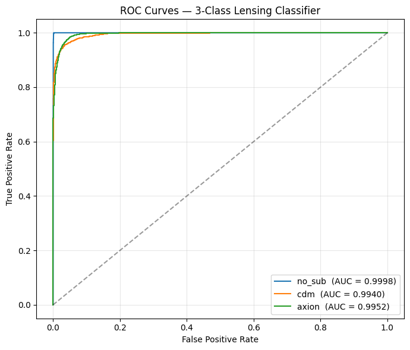
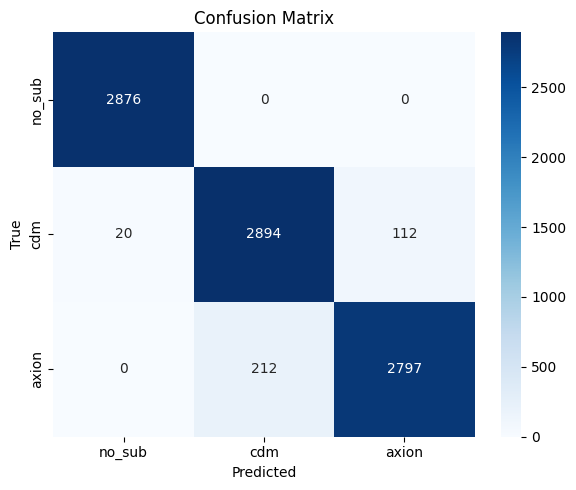
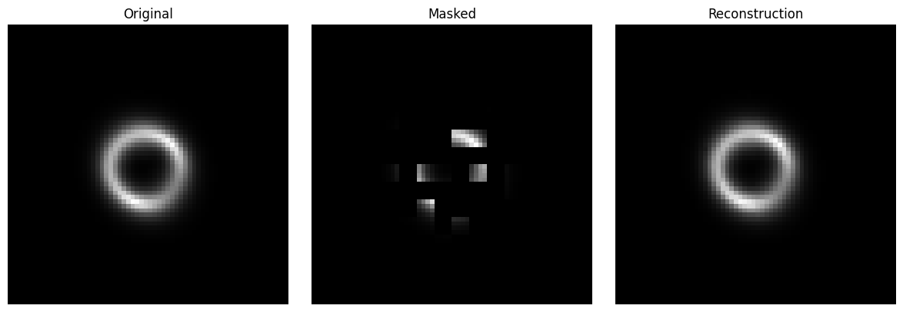
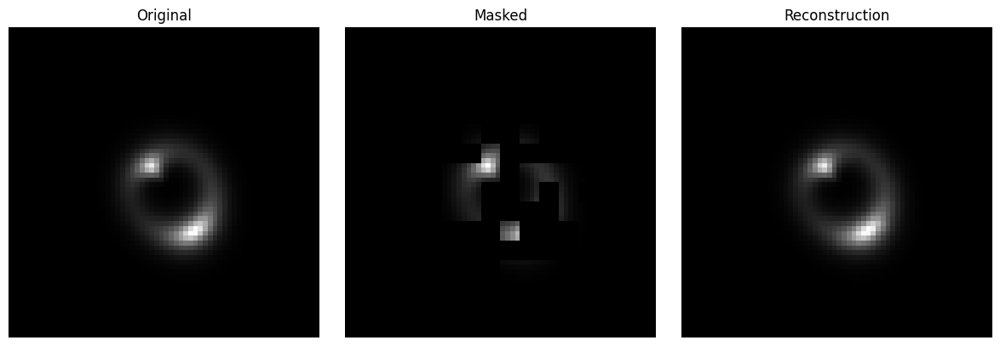
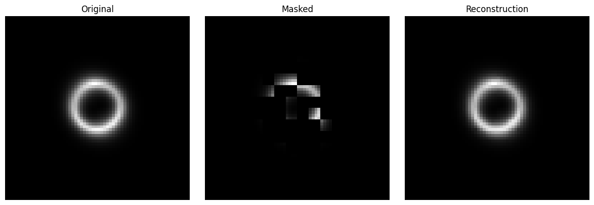
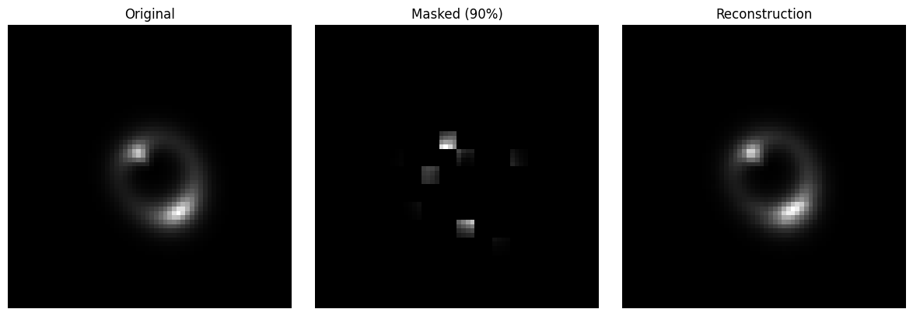
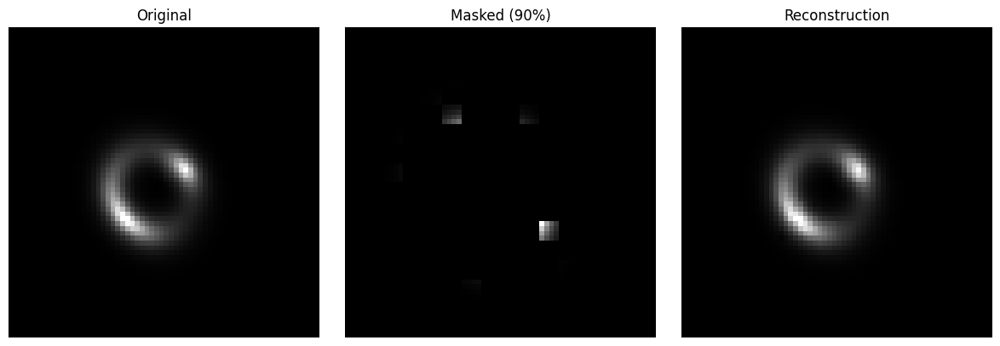
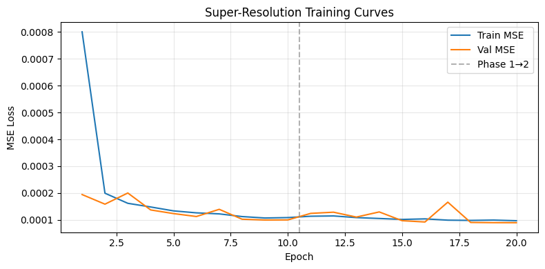

I tried 75% and 90% masking for my MAE Pre-training, and here are the results for the Classification Task (TaskIX.A).
| Mask Percentage | Macro | no_sub | cdm | axion |
|---|---|---|---|---|
| 75 | 0.9927 | 0.9984 | 0.9869 | 0.9929|
| 90 | 0.9963 | 0.9998 | 0.9940 | 0.9952|

# ROC-AUC Curve for Classification with 90 percent Masked Pre-Training.

# Confusion Matrix for Classification with 90 percent Masked Pre-Training.

# MAE Reconstruction with Masked Percentage of 75 percent.

# MAE Reconstruction with Masked Percentage of 90 percent.

# SR Task(Task IX.B) Loss Curve

# Super Resolution Output and Comparison

