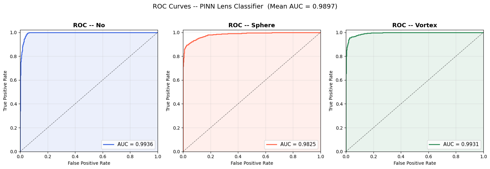
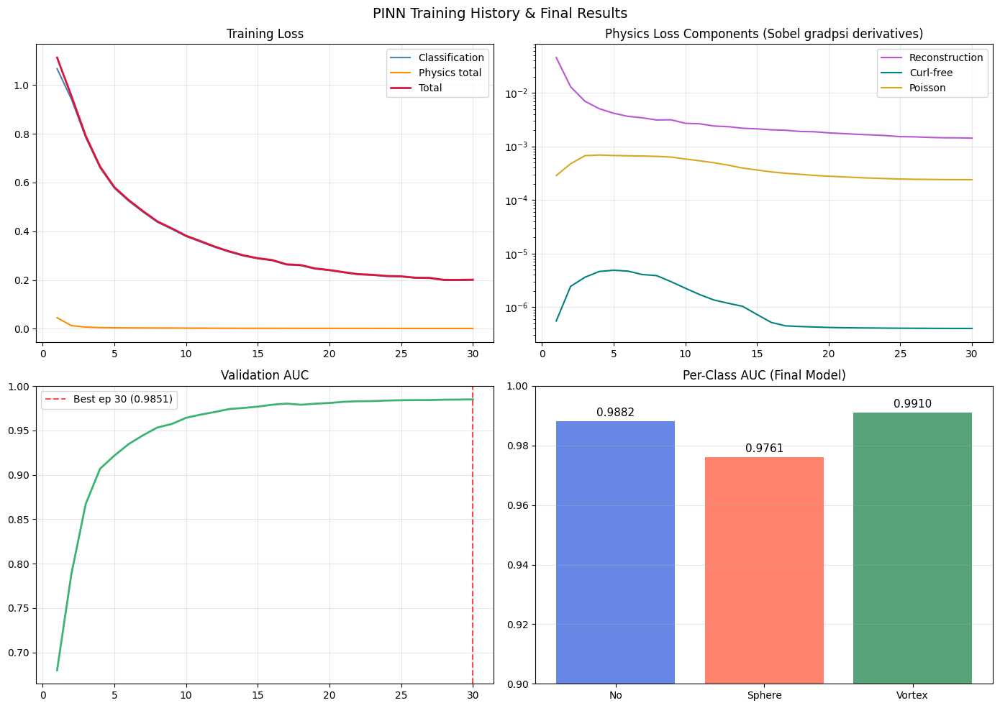

# Task VII: Physics-Guided ML Results

This folder contains the results for the three PINN approaches developed for Task VII.

## Summary of Approaches

| Model | Mean Val-AUC | No Substructure | Sphere | Vortex |
|---|---|---|---|---|
| **Approach 1 (Baseline)** | **0.9928** | *Pending* | *Pending* | *Pending* |
| Approach 2 (Adaptive) | 0.9902 | 0.9936 | 0.9831 | 0.9937 |
| Approach 3 (Hybrid) | 0.9893 | 0.9913 | 0.9826 | 0.9941 |

---

## Approach 1: Baseline PINN (ResNet-18)

A "pure" physics-informed model enforcing the curl-free constraint ($\alpha = \nabla \psi$).

### Results
*(Placeholders for generated images)*
- **Training Curves:** `Appr1_Training.png`
- **ROC Curves:** `Appr1_ROC.png`
- **Physics Visualization:** `Appr1_Physics.png`

---

## Approach 2: Advanced Adaptive PINN

A sophisticated PINN using adaptive uncertainty weighting, polar coordinates, and cycle consistency.

### Results
*(Placeholders for generated images)*
- **Training Curves:** `Appr2_Training.png`
- **ROC Curves:** `Appr2_ROC.png`
- **Physics Visualization:** `Appr2_Physics.png`

---

## Approach 3: Hybrid Fusion PINN (EfficientNet-B3)

Formerly `PINN_Classification50Epoch_TaskVII`. This model fuses EfficientNet backbone features with derived physics fields.
Tested with 30 and 50 epochs. Reconstructions were slightly improved with 50 epochs; significant AUC improvement.

### 50 Epochs (Final)
#### ROC-AUC Curve (Validation Folder)

#### ROC-AUC Curve (Internal Test Set)

#### Training Curves

#### Reconstructed Images

### 30 Epochs (Comparison)
#### ROC-AUC Curve

#### Training Curves

#### Reconstructed Images

