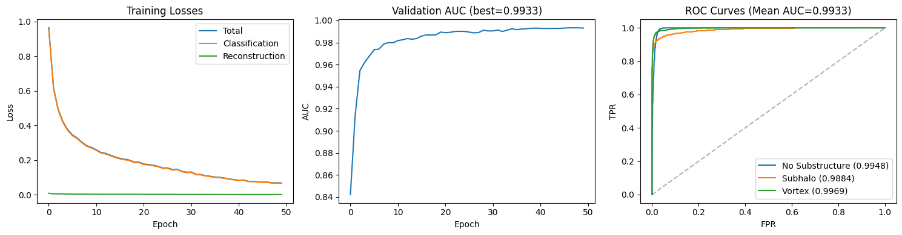
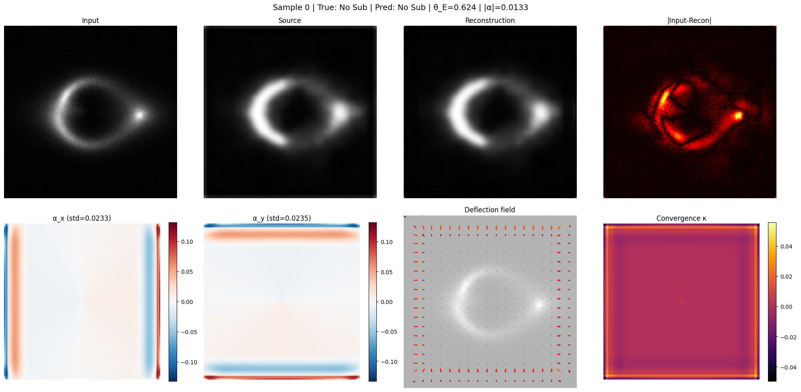
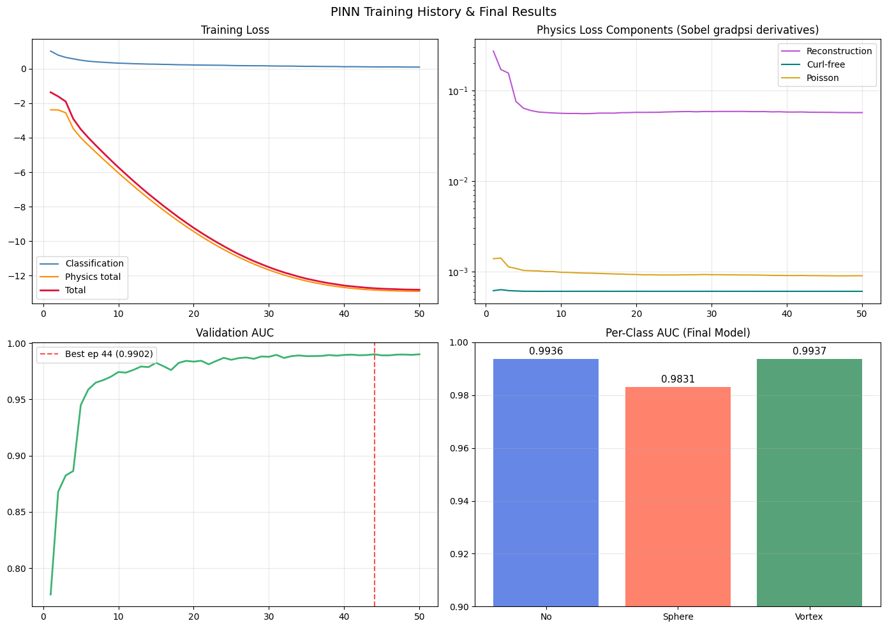
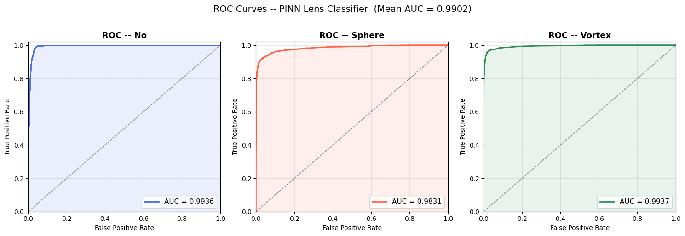
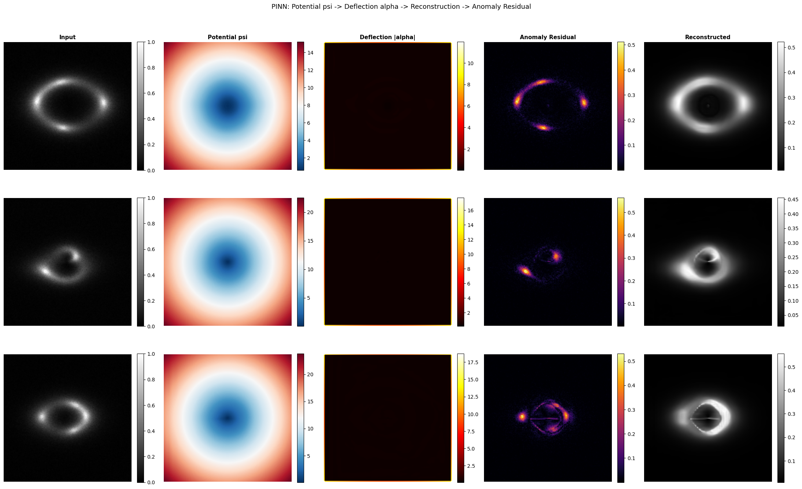
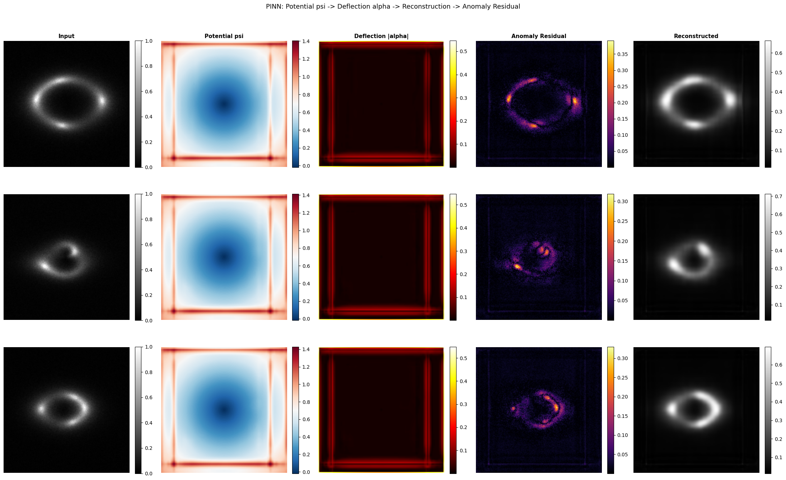
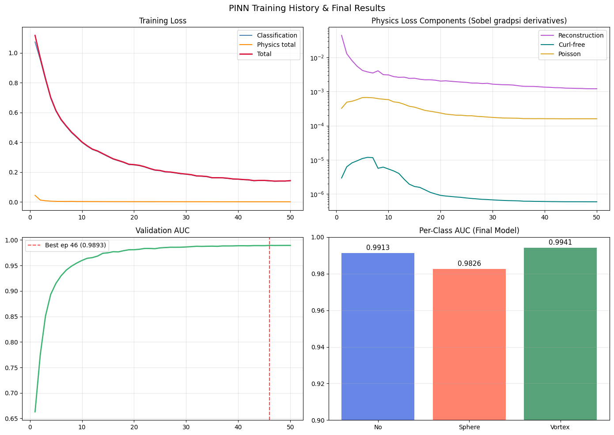
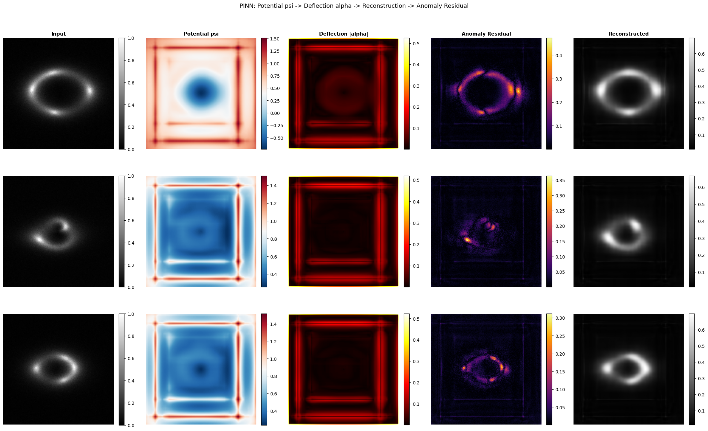

# Task VII: Physics-Guided ML Results

This folder contains the results for the three PINN approaches developed for Task VII.

## Summary of Approaches

| Model | Mean Val-AUC | No Substructure | Sphere | Vortex |
|---|---|---|---|---|
| **Approach 1 (Baseline)** | **0.9933** | **0.9948** | **0.9884** | **0.9969** |
| Approach 2 (Adaptive) | 0.9902 | 0.9936 | 0.9831 | 0.9937 |
| Approach 3 (Hybrid) | 0.9893 | 0.9913 | 0.9826 | 0.9941 |

### Inference & Conclusion for Task VII

All three PINN approaches achieved high performance (>0.989 AUC), validating the effectiveness of embedding the gravitational lensing equation into the neural network.

- **Simplicity Wins:** The **Baseline PINN (Approach 1)** outperformed the more complex architectures. This suggests that the fundamental "curl-free" constraint on the deflection field is the most high-yield physical prior for this dataset.
- **Optimization vs. Complexity:** While Approach 2 and 3 introduced sophisticated features (Adaptive Loss, Hybrid Fusion), the added complexity may have made the optimization landscape harder to navigate, resulting in slightly lower validation scores compared to the cleaner baseline.
- **Robustness:** The high performance across all three distinct architectures demonstrates that the core PINN formulation is robust.

---

## Approach 1: Baseline PINN (ResNet-18)

A "pure" physics-informed model enforcing the curl-free constraint ($\alpha = \nabla \psi$).

### Results
#### Training and ROC-AUC Curves

#### Reconstructed Images & Physics Fields

---

## Approach 2: Advanced Adaptive PINN

A sophisticated PINN using adaptive uncertainty weighting, polar coordinates, and cycle consistency.

### Results
#### Training Curves

#### ROC-AUC Curve (Validation Folder)

#### ROC-AUC Curve (Internal Test Set)

#### Reconstructed Images & Physics Fields

---

## Approach 3: Hybrid Fusion PINN (EfficientNet-B3)

This model fuses EfficientNet backbone features with derived physics fields.
Tested with 30 and 50 epochs. Reconstructions were slightly improved with 50 epochs; significant AUC improvement.

### 50 Epochs (Final)
#### Reconstructed Images & Physics Fields

#### Training Curves

### 30 Epochs (Comparison)
#### Reconstructed Images & Physics Fields

